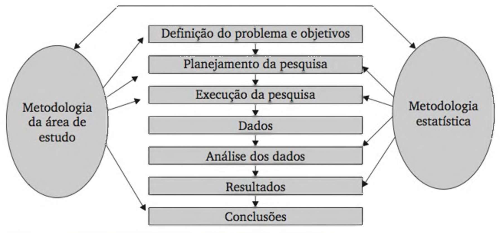
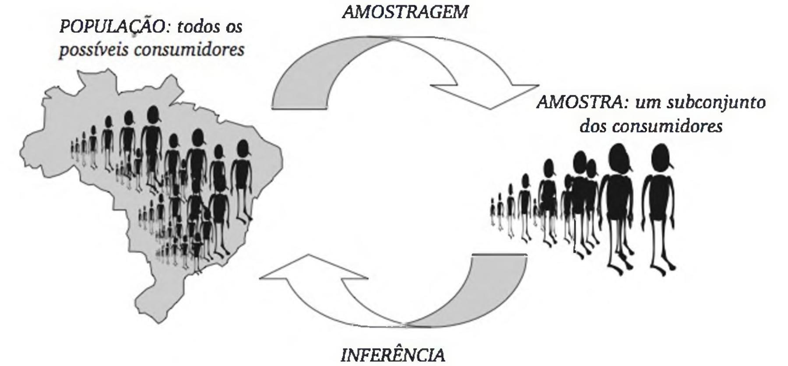

 
<b>

    Graduação em Ciência da Computação

</b>
 
 
<b>

    Disciplina: Métodos Quantitativos em Computação

</b>

**Orientador: Prof. Me. Ricardo Carubbi**  
*Docente da Graduação e Pós-Graduação em Ciência de Dados e Inteligência Artificial* 
*Laboratório de Ciência de Dados e Inteligência Artificial* 
*Universidade de Fortaleza* 

Lattes: http://lattes.cnpq.br/5738786447903616 |
GitHub: https://github.com/carubbi/

[Unifor.br](https://unifor.br/) | [Instagram](https://www.instagram.com/uniforcomunica/?hl=pt-br) | [Facebook](https://www.facebook.com/uniforoficial/) | [Twitter](https://www.facebook.com/uniforoficial/)  | [LinkedIn](https://www.linkedin.com/school/university-of-fortaleza/?originalSubdomain=pt) | [TV Unifor](https://www.unifor.br/tv-unifor) | [G1/Ensinando e Aprendendo](https://g1.globo.com/ce/ceara/especial-publicitario/unifor/ensinando-e-aprendendo/)

# Fundamentos estatísticos e investigação com dados

- **Unidade:** I
- **Aula:** 2
- **Semana:** 1
- **Data:** 07/08/2026
- **Duração:** 100 minutos
- **Conteúdo formal:** `01.01`
- **Tópicos:** Estatística; investigação; variabilidade; população; amostra; amostragem; representatividade; descrição; inferência; vieses; alcance das conclusões
- **Resultado de aprendizagem:** formular uma pergunta estatística, distinguir descrição e inferência e justificar o alcance das conclusões a partir da origem e da seleção dos registros.

---

## Agenda

1. **Investigação estatística e variabilidade — 30 min**
2. **População, amostra, representatividade e vieses — 35 min**
3. **Descrição, inferência e alcance das conclusões — 35 min**

- **Percurso por tópico:** problema e contexto → fundamentação científica → resolução manual → aplicação computacional → comparação → diagnóstico e interpretação.

---

## Pergunta orientadora

> O que pode ser descrito com os pinguins observados e até onde essas conclusões podem ser generalizadas?

---

## Contexto recorrente

- **Conjunto:** Palmer Penguins, apresentado na Aula 1.[1]
- **Registros:** 344 pinguins observados.
- **Cobertura:** três espécies e três ilhas do Arquipélago Palmer.
- **Coleta:** Kristen Gorman e Palmer Station Antarctica LTER.
- **Unidade de análise:** pinguim observado no contexto do estudo.
- **Alcance:** o arquivo não representa automaticamente todos os pinguins das espécies, ilhas ou períodos.
- **Casos reduzidos:** registros reais; acréscimos didáticos identificados por `*`.
- **Aplicações computacionais:** somente registros e colunas públicas.
- **Referência operacional:** `penguins_raw.csv` como população finita para comparações internas, não como população biológica total.

<small>Rodapé — [1] HORST; HILL; GORMAN (2020), seções “About the data” e “penguins_raw — Format”.</small>

---

### Ciclo didático 1 — Investigação estatística e variabilidade

#### Problema e contexto

Os pinguins observados diferem em espécie, ilha e medidas corporais, mas nem toda pergunta pode ser respondida pelas variáveis disponíveis. Uma investigação estatística precisa identificar a unidade observada, reconhecer a variabilidade relevante e formular uma pergunta sustentada pelos dados.[1]

<small>Rodapé — [1] HORST; HILL; GORMAN (2020), seção “penguins_raw — Format”.</small>

---

#### Investigação estatística

- **Estatística:** métodos para formular perguntas, obter dados, representar a variabilidade, analisar evidências e comunicar conclusões.[2][3]
- **Investigação estatística:**

1. delimitar o problema;
2. formular uma pergunta respondível;
3. definir população, unidade de análise e informações necessárias;
4. reconhecer ou planejar a obtenção dos dados;
5. analisar variabilidade e padrões;
6. comunicar a conclusão e seu alcance.

**Figura 1 - Etapas de uma investigação estatística.** A metodologia do campo estudado e a metodologia estatística apoiam as diferentes etapas da pesquisa, da definição do problema às conclusões. Fonte: Barbetta, Bornia e Reis (2010, figura 2.1).

<small>Rodapé — [2] ARAÚJO; SILVA, cap. 1, seções 1.1–1.3, p. PDF 8–10. [3] BARBETTA; BORNIA; REIS (2010), caps. 1–2, seções 1.2, 1.6 e 2.1, p. PDF 13, 18–24.</small>

---

#### Origem dos dados e variabilidade

- **Dados observacionais:** características registradas sem atribuição controlada de uma intervenção.[3][5]
- **Experimento:** intervenção aplicada segundo um desenho de comparação.[3][5]
- **Palmer Penguins:** dados observacionais; não sustenta causalidade por si só.[1]
- **Variabilidade:** diferenças entre valores observados nas unidades de análise.[3][4]
- **Fontes possíveis:** indivíduos, espécies, ilhas, períodos, coleta, medição e preparação.
- **Cuidados:** ausência não é zero; valor incomum não é erro automático.

<small>Rodapé — [1] HORST; HILL; GORMAN (2020), seção “About the data”. [3] BARBETTA; BORNIA; REIS (2010), caps. 1–2, seções 1.2, 1.6 e 2.3, p. PDF 13, 18–23 e 34–50. [4] BRUCE; BRUCE; GEDECK (2020), cap. 1, seção “Estimates of Variability”. [5] NAVIDI (2024), cap. 1, seções 1.0–1.1, p. PDF 23–34.</small>

---

#### Caso reduzido e resolução manual

| `studyName` | `Individual ID` | `Species` | `Island` | `Body Mass (g)` |
| --- | --- | --- | --- | ---: |
| PAL0708 | N1A1 | Adelie Penguin (Pygoscelis adeliae) | Torgersen | 3750 |
| PAL0708 | N1A2 | Adelie Penguin (Pygoscelis adeliae) | Torgersen | 3800 |
| PAL0708 | N31A1 | Gentoo penguin (Pygoscelis papua) | Biscoe | 4500 |
| PAL0708 | N31A2 | Gentoo penguin (Pygoscelis papua) | Biscoe | 5700 |
| PAL0708 | N61A1 | Chinstrap penguin (Pygoscelis antarctica) | Dream | 3500 |
| PAL0708 | N61A2 | Chinstrap penguin (Pygoscelis antarctica) | Dream | 3900 |

**Tabela 1 - Seis observações reais para formular uma pergunta estatística.**

- Seis registros reais do mesmo arquivo.[1]
- Massas observadas: 3500 g a 5700 g.
- O maior valor exige investigação antes de ser classificado como erro.

- **Pergunta respondível:**

> Como a massa corporal varia entre estes seis pinguins observados?

- **Pergunta não sustentada:** “A ilha causou as diferenças de massa?”
- **Limitação:** as colunas disponíveis não estabelecem um desenho causal.

<small>Rodapé — [1] HORST; HILL; GORMAN (2020), seção “penguins_raw — Format”. [3] BARBETTA; BORNIA; REIS (2010), cap. 2, seção 2.3 “Planejamento de experimentos”, p. PDF 34–50.</small>

---

#### Aplicação computacional

- Contar observações por espécie com `Series.value_counts()`.[7]
- Resumir `Body Mass (g)` com `Series.describe()`.[7]
- Inspecionar tipos e contagens de valores não ausentes com `DataFrame.info()`.[7]
- Comparar as contagens não ausentes com as 344 linhas para identificar variáveis com ausências.
- Interpretar a saída com base na pergunta e na unidade de análise.

<small>Rodapé — [7] PANDAS DEVELOPMENT TEAM, seções “DataFrame.info”, “Series.value_counts” e “Series.describe”.</small>

---

#### Comparação

| Pergunta | Pode ser respondida diretamente? | Justificativa |
| --- | --- | --- |
| Quantos pinguins foram registrados por espécie? | sim | `Species` está disponível |
| Como a massa corporal varia nas observações válidas? | sim | `Body Mass (g)` está disponível |
| A massa corporal de cada pinguim mudou ao longo da vida? | não | não há acompanhamento longitudinal de cada animal |
| A ilha causou diferenças de massa? | não | a tabela não estabelece um experimento causal |

- Disponibilidade da coluna não garante adequação da pergunta.
- Associação observada não estabelece efeito causal.

<small>Rodapé — [1] HORST; HILL; GORMAN (2020), seção “penguins_raw — Format”. [3] BARBETTA; BORNIA; REIS (2010), cap. 2, seção 2.3 “Planejamento de experimentos”, p. PDF 34–50.</small>

---

#### Diagnóstico e interpretação

- Admitir variação entre as observações.
- Identificar a unidade de análise.
- Usar informações disponíveis e documentadas.
- Investigar valores incomuns.
- Não tratar diferença como erro automático.

<small>Rodapé — [3] BARBETTA; BORNIA; REIS (2010), cap. 1, seções 1.2 e 1.6, p. PDF 13 e 18–23. [4] BRUCE; BRUCE; GEDECK (2020), cap. 1, seção “Estimates of Variability”.</small>

---

### Ciclo didático 2 — População, amostra, representatividade e vieses

#### Problema e contexto

As 344 observações descrevem o arquivo disponibilizado, mas o tamanho do conjunto não garante que ele represente todos os pinguins de interesse. O alcance da análise depende da população definida, do processo de seleção e das inclusões ou exclusões ocorridas durante a coleta.[1]

<small>Rodapé — [1] HORST; HILL; GORMAN (2020), seções “About the data” e “penguins_raw — Format”.</small>

---

#### População e amostra

- **População:** conjunto de unidades sobre o qual se pretende responder.
- **Censo:** observação de todas as unidades da população definida.
- **Amostra:** subconjunto efetivamente observado.
- **Amostragem:** processo de seleção das unidades.
- **Quadro amostral:** representação operacional das unidades que poderiam ser selecionadas.

**Figura 2 - Relação entre população, amostra, amostragem e inferência.** A amostragem seleciona um subconjunto da população; a inferência usa a amostra para responder sobre a população, condicionada à qualidade da seleção. Fonte: Barbetta, Bornia e Reis (2010, figura 2.2).

<small>Rodapé — [2] ARAÚJO; SILVA, cap. 1, seção 1.2 “Conceitos Fundamentais”, p. PDF 8–9. [3] BARBETTA; BORNIA; REIS (2010), caps. 1–2, seções 1.6, 2.1 e 2.2, p. PDF 18–33. [6] PINHEIRO et al. (2009), cap. 1, seção 1.2 “População e Amostra”, p. PDF 22–23.</small>

---

#### Representatividade e vieses

- **População finita de referência:** as 344 observações do arquivo.
- **Censo interno:** todas as linhas dessa população finita.
- **População mais ampla:** requer justificativa para generalização.
- **Representatividade:** depende da seleção, não apenas do tamanho.[3][5][6]
- **Viés de seleção:** favorecimento sistemático de certas unidades.
- **Viés de medição:** diferença sistemática entre registro e característica pretendida.

<small>Rodapé — [3] BARBETTA; BORNIA; REIS (2010), cap. 2, seções 2.1–2.2, p. PDF 24–33. [5] NAVIDI (2024), cap. 1, seção 1.1 “Sampling”, p. PDF 25–34. [6] PINHEIRO et al. (2009), cap. 1, seção 1.2 “População e Amostra”, p. PDF 22–23.</small>

---

#### Caso reduzido e resolução manual

- **População finita reduzida:** seis observações reais da Tabela 1.[1]
- **Plano A:** selecionar as três primeiras linhas.
- **Plano B:** selecionar aleatoriamente uma linha de cada espécie.

| `studyName` | `Individual ID` | `Species` | `Island` | `Body Mass (g)` |
| --- | --- | --- | --- | ---: |
| PAL0708 | N1A1 | Adelie Penguin (Pygoscelis adeliae) | Torgersen | 3750 |
| PAL0708 | N1A2 | Adelie Penguin (Pygoscelis adeliae) | Torgersen | 3800 |
| PAL0708 | N31A1 | Gentoo penguin (Pygoscelis papua) | Biscoe | 4500 |

**Tabela 2 - Resultado do Plano A.** As três linhas pertencem ao arquivo original.[1]

- A seleção depende da ordenação.
- Chinstrap foi excluída neste resultado.

| `studyName` | `Individual ID` | `Species` | `Island` | `Body Mass (g)` |
| --- | --- | --- | --- | ---: |
| PAL0708 | N1A1 | Adelie Penguin (Pygoscelis adeliae) | Torgersen | 3750 |
| PAL0708 | N31A1 | Gentoo penguin (Pygoscelis papua) | Biscoe | 4500 |
| PAL0708 | N61A1 | Chinstrap penguin (Pygoscelis antarctica) | Dream | 3500 |

**Tabela 3 - Um resultado possível do Plano B.** As três linhas pertencem ao arquivo original.[1]

- As três espécies estão presentes.
- As proporções da população de referência não são preservadas necessariamente.

<small>Rodapé — [1] HORST; HILL; GORMAN (2020), seção “penguins_raw — Format”. [3] BARBETTA; BORNIA; REIS (2010), cap. 2, seção 2.2.1 “Procedimentos de amostragem”, p. PDF 25–31.</small>

---

#### Aplicação computacional

- Gerar duas amostras reproduzíveis com `DataFrame.sample(n=10, random_state=...)`.[7]
- Calcular proporções com `Series.value_counts(normalize=True)`.[7]
- Comparar população finita de referência e amostras.
- Reconhecer variabilidade entre amostras do mesmo procedimento.
- Filtrar Biscoe e verificar as espécies disponíveis.
- Usar somente linhas e colunas reais.

<small>Rodapé — [7] PANDAS DEVELOPMENT TEAM, seções “DataFrame.sample” e “Series.value_counts”.</small>

---

#### Comparação

| Seleção | Cobertura | Limitação principal |
| --- | --- | --- |
| primeiros registros disponíveis | depende da ordenação do arquivo | pode concentrar condições semelhantes |
| somente a ilha Biscoe | restrita a uma ilha | não permite selecionar Chinstrap e restringe Adelie às observações de Biscoe |
| sorteio entre registros disponíveis | distribui a chance dentro do arquivo | não corrige limites da coleta original |
| sorteio dentro de cada espécie | assegura presença das espécies | altera a composição se os tamanhos por grupo forem igualados |

> **Link:** [IBGE — PNAD Contínua: amostra e representatividade](https://painel.ibge.gov.br/saibamais/)

<small>Rodapé — [3] BARBETTA; BORNIA; REIS (2010), cap. 2, seção 2.2.1 “Procedimentos de amostragem”, p. PDF 25–31. [8] IBGE, seção “PNAD Contínua: amostra e representatividade”.</small>

---

#### Diagnóstico e interpretação

- Tamanho maior pode reduzir variabilidade amostral.
- Tamanho maior não corrige seleção inadequada.
- Diagnosticar população pretendida e cobertura.
- Examinar espécie, ilha, período e perdas de observação.
- Declarar o procedimento efetivo de seleção.

<small>Rodapé — [3] BARBETTA; BORNIA; REIS (2010), cap. 2, seções 2.1–2.2, p. PDF 24–33. [5] NAVIDI (2024), cap. 1, seção 1.1 “Sampling”, p. PDF 25–34.</small>

---

### Ciclo didático 3 — Descrição, inferência e alcance das conclusões

#### Problema e contexto

Um resultado numérico pode descrever corretamente as observações disponíveis e, ainda assim, não sustentar uma conclusão sobre uma população mais ampla. O problema consiste em distinguir o que foi efetivamente observado daquilo que dependeria de representatividade e de um procedimento inferencial adequado.

<small>Rodapé — [4] BRUCE; BRUCE; GEDECK (2020), cap. 2, seções sobre amostragem e viés.</small>

---

#### Estatística descritiva e inferencial

- **Estatística descritiva:** resume e representa as observações disponíveis.
- **Estatística inferencial:** usa dados amostrais e um modelo para avaliar características de uma população definida.
- **Parâmetro populacional:** característica da população.
- **Estatística amostral:** resultado calculado a partir da amostra para descrevê-la ou estimar uma característica da população.

Uma estatística amostral pode ser expressa como:

$$
\widehat{\theta}=g(X_1,X_2,\ldots,X_n),
$$

em que:

- $\widehat{\theta}$ é a estatística calculada a partir da amostra;
- $\theta$ é o parâmetro populacional que pode ser estimado por $\widehat{\theta}$;
- $g$ é a regra de cálculo aplicada aos valores observados;
- $X_i$ é o valor observado na unidade $i$;
- $i$ identifica cada unidade da amostra;
- $n$ é o tamanho da amostra.

- Correção algébrica não garante representatividade nem generalização.

<small>Rodapé — [2] ARAÚJO; SILVA, cap. 1, seções 1.1–1.2, p. PDF 8–9. [4] BRUCE; BRUCE; GEDECK (2020), cap. 2, seções sobre amostragem e viés. [6] PINHEIRO et al. (2009), cap. 1, seções 1.1–1.2, p. PDF 20–23.</small>

---

#### Caso reduzido e resolução manual

- Retomar as seis observações reais da Tabela 1.[1]
- Cada espécie aparece duas vezes.

| `Species` | Frequência absoluta | Proporção observada |
| --- | ---: | ---: |
| Adelie Penguin (Pygoscelis adeliae) | 2 | $2/6=0{,}333$ |
| Gentoo penguin (Pygoscelis papua) | 2 | $2/6=0{,}333$ |
| Chinstrap penguin (Pygoscelis antarctica) | 2 | $2/6=0{,}333$ |

**Tabela 4 - Composição das seis observações reais da Tabela 1.** As frequências pertencem ao caso reduzido; nenhuma linha ou espécie foi criada.

Para Adelie, por exemplo,

$$
\widehat{p}_{Adelie}=\frac{2}{6}=0{,}333.
$$

em que:

- $\widehat{p}_{Adelie}$ é a proporção de pinguins Adelie no caso reduzido;
- $2$ é o número de observações da espécie Adelie;
- $6$ é o número total de observações do caso reduzido;
- $0{,}333$ é a proporção observada, equivalente a 33,3%.

- **Descrição sustentada:** 33,3% destes seis pinguins observados são Adelie.
- **Inferência não sustentada:** 33,3% de todos os pinguins das três espécies são Adelie.
- **Limitação:** seleção intencional e balanceada de seis linhas.

<small>Rodapé — [1] HORST; HILL; GORMAN (2020), seção “penguins_raw — Format”. [2] ARAÚJO; SILVA, cap. 1, seções 1.1–1.2, p. PDF 8–9.</small>

---

#### Aplicação computacional

- Calcular contagens e proporções de `Species` com `Series.value_counts()`.[7]
- Calcular limites de `Body Mass (g)` com `min()` e `max()`.[7]
- **Arquivo:** 152 Adelie, 124 Gentoo e 68 Chinstrap.[1]
- **Massas registradas:** 342 valores entre 2700 g e 6300 g.[1]
- Os cálculos descrevem o arquivo.
- As 344 linhas não se tornam amostra probabilística por causa do cálculo.

<small>Rodapé — [1] HORST; HILL; GORMAN (2020), seção “penguins_raw — Format”. [7] PANDAS DEVELOPMENT TEAM, seções “Series.value_counts”, “Series.min” e “Series.max”.</small>

---

#### Comparação

| Afirmação | Natureza | Avaliação |
| --- | --- | --- |
| o arquivo contém 152 observações Adelie | descritiva | sustentada pela base |
| as 342 massas registradas variam de 2700 g a 6300 g | descritiva | sustentada pela base |
| Adelie constitui 44,2% de todos os pinguins do arquipélago | inferencial | não sustentada automaticamente |
| a ilha causou a diferença de massa corporal | causal | não sustentada |

- Descrições devem nomear o arquivo ou as observações.
- Inferências exigem população definida, seleção justificável e modelo.
- Causalidade exige desenho compatível.

<small>Rodapé — [3] BARBETTA; BORNIA; REIS (2010), caps. 1–2, seções 1.6, 2.1 e 2.3, p. PDF 18–24 e 34–50. [4] BRUCE; BRUCE; GEDECK (2020), cap. 2, seções sobre amostragem e viés.</small>

---

#### Diagnóstico e interpretação

- Identificar a base observada.
- Declarar a população de referência.
- Informar limitações de generalização.
- Considerar coleta, espécie, ilha, período e seleção.
- Evitar extrapolações automáticas.

<small>Rodapé — [4] BRUCE; BRUCE; GEDECK (2020), cap. 2, seções sobre amostragem e viés. [5] NAVIDI (2024), cap. 1, seção 1.1 “Sampling”, p. PDF 25–34.</small>

---

## Erros comuns e cuidados interpretativos

- Confundir linha do arquivo com espécie, ilha ou ninho.
- Tratar a base disponível como toda a população de interesse.
- Afirmar representatividade apenas porque $n$ é grande.
- Declarar um valor extremo como erro sem investigar sua origem.
- Confundir descrição do arquivo com inferência para outros pinguins.
- Confundir associação observada com efeito causal.
- Formular perguntas que as variáveis disponíveis não respondem.
- Omitir fonte, unidade, seleção e alcance ao comunicar resultados.

<small>Rodapé — [3] BARBETTA; BORNIA; REIS (2010), caps. 1–2, p. PDF 12–50. [4] BRUCE; BRUCE; GEDECK (2020), caps. 1–2. [5] NAVIDI (2024), cap. 1, seções 1.0–1.1, p. PDF 23–34.</small>

---

## Estudo e exercícios

### Materiais didáticos

- [Apostila de Métodos Quantitativos](../apostila/apostila_mq.pdf): seções 1.1–1.3, páginas 8–10.
- [Banco de questões e provas 2026.2](../apostila/banco_questoes_provas_2026_2.pdf): seção 1.1, páginas 7–13.
- [Palmer Penguins](https://allisonhorst.github.io/palmerpenguins/): fonte, documentação e arquivos utilizados nos casos e nas aplicações.
- [Notebook da Aula 2](../notebooks/u1_a02_fundamentos_investigacao_dados.ipynb): prática de amostragem, variabilidade e viés.

### Exercícios indicados

- Banco de questões, questão 6: descrição e inferência.
- Banco de questões, questão 5: etapas do método estatístico.
- Barbetta et al., capítulo 1, exercício 2: população e amostra.
- Barbetta et al., capítulo 2, exercício 7: avaliação crítica de um plano amostral.

---

## Referências

- [1] HORST, Allison Marie; HILL, Alison Presmanes; GORMAN, Kristen B. *palmerpenguins: Palmer Archipelago (Antarctica) penguin data*. 2020. DOI: [10.5281/zenodo.3960218](https://doi.org/10.5281/zenodo.3960218).
- [2] ARAÚJO, Cledinaldo Castro; SILVA, Vera Lúcia. *Métodos quantitativos para engenharia: questões contextualizadas & exercícios*. 2. ed. Disponível em: [Apostila de Métodos Quantitativos](../apostila/apostila_mq.pdf).
- [3] BARBETTA, Pedro Alberto; BORNIA, Antonio Cezar; REIS, Marcelo Menezes. *Estatística para cursos de engenharia e informática*. 3. ed. São Paulo: Atlas, 2010.
- [4] BRUCE, Peter; BRUCE, Andrew; GEDECK, Peter. *Practical statistics for data scientists*. 2. ed. Sebastopol: O'Reilly, 2020.
- [5] NAVIDI, William. *Statistics for engineers and scientists*. 6. ed. New York: McGraw Hill, 2024.
- [6] PINHEIRO, João Ismael Dantas et al. *Estatística básica: a arte de trabalhar com dados*. Rio de Janeiro: Elsevier, 2009.
- [7] PANDAS DEVELOPMENT TEAM. *pandas documentation*. 2026. Disponível em: <https://pandas.pydata.org/docs/reference/api/pandas.DataFrame.sample.html>.
- [8] IBGE. *PNAD Contínua: amostra e representatividade*. Disponível em: <https://painel.ibge.gov.br/saibamais/>. Acesso em: 11 ago. 2026.
