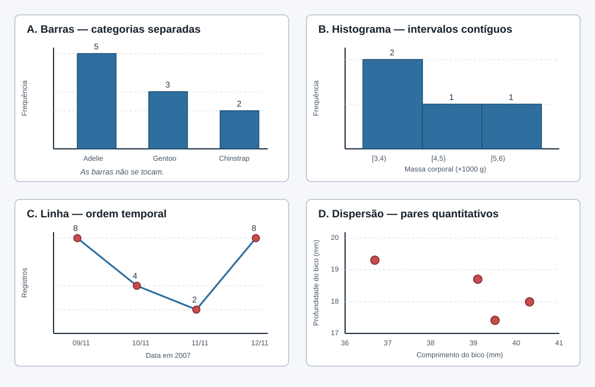

 
<b>

    Graduação em Ciência da Computação

</b>
 
 
<b>

    Disciplina: Métodos Quantitativos em Computação

</b>

**Orientador: Prof. Me. Ricardo Carubbi**  
*Docente da Graduação e Pós-Graduação em Ciência de Dados e Inteligência Artificial* 
*Laboratório de Ciência de Dados e Inteligência Artificial* 
*Universidade de Fortaleza* 

Lattes: http://lattes.cnpq.br/5738786447903616 |
GitHub: https://github.com/carubbi/

[Unifor.br](https://unifor.br/) | [Instagram](https://www.instagram.com/uniforcomunica/?hl=pt-br) | [Facebook](https://www.facebook.com/uniforoficial/) | [Twitter](https://www.facebook.com/uniforoficial/) | [LinkedIn](https://www.linkedin.com/school/university-of-fortaleza/?originalSubdomain=pt) | [TV Unifor](https://www.unifor.br/tv-unifor) | [G1/Ensinando e Aprendendo](https://g1.globo.com/ce/ceara/especial-publicitario/unifor/ensinando-e-aprendendo/)

# Distribuições de frequências e visualização de dados

- **Unidade:** I
- **Aula:** 6
- **Semana:** 3
- **Data:** 21/08/2026
- **Duração:** 100 minutos
- **Conteúdos formais:** `01.02`
- **Tópicos:** frequências absoluta, relativa e acumulada; dados agrupados; classes; tabelas; gráficos de barras; histogramas; gráficos de linha e de dispersão.
- **Resultado de aprendizagem:** construir distribuições de frequências e escolher representações adequadas, justificando denominadores, agrupamentos e critérios para definição das classes.

---

## Agenda

1. **Frequências absoluta, relativa e acumulada — 20 min**
2. **Dados agrupados em classes — 25 min**
3. **Critérios para definição das classes — 30 min**
4. **Escolha da representação — 25 min**

Cada tópico percorre um ciclo didático completo: problema e contexto, fundamentação científica, resolução manual, aplicação computacional, comparação, diagnóstico e interpretação.

## Pergunta orientadora

> Como resumir e representar distribuições sem esconder o efeito dos denominadores, dos agrupamentos e das escolhas gráficas?

## Contexto recorrente

A aula dá continuidade ao diagnóstico do **Palmer Penguins** realizado na Aula 5. `Species` será usada para frequências de categorias nominais; `Body Mass (g)`, para classes e histogramas; `Date Egg`, como eixo temporal para as contagens de registros por data; e o par `Culmen Length (mm)` e `Culmen Depth (mm)`, para dispersão. A data é uma variável temporal, enquanto a contagem obtida em cada data é quantitativa discreta. Das 344 observações, 342 possuem massa corporal registrada; esse denominador precisa acompanhar toda distribuição da variável.

#### Preparação computacional

- **Pacotes:** `pandas`, `numpy` e `matplotlib.pyplot`.
- Carregar `penguins_raw.csv` com `pd.read_csv()`.
- Conferir dimensões, nomes, tipos e ausências com `shape`, `columns`, `dtypes` e `isna().sum()`.
- Preservar as 344 linhas e considerar somente as 342 massas válidas quando a análise exigir `Body Mass (g)`.

---

### Ciclo didático 1 — Frequências absoluta, relativa e acumulada

#### Problema e contexto

No Palmer Penguins, as 344 observações estão distribuídas entre três espécies. Para comparar essa composição, é necessário apresentar as contagens e suas proporções, mantendo explícito o total usado como denominador. Como `Species` não possui ordem natural, uma frequência acumulada dependeria de uma ordenação arbitrária.

#### Fundamentação científica

As frequências relativa e percentual de uma categoria são calculadas por:

$$
h_j=\frac{f_j}{n}, \qquad p_j=100h_j. \tag{1.1}
$$

em que:

- $j$ identifica a categoria analisada;
- $f_j$ é a frequência absoluta da categoria $j$;
- $n$ é o número total de valores válidos;
- $h_j$ é a frequência relativa da categoria $j$;
- $p_j$ é a frequência percentual da categoria $j$.

Frequências acumuladas exigem uma ordem substantiva. Como espécie é nominal, acumulá-la dependeria de uma ordem arbitrária e não acrescentaria interpretação.

#### Caso reduzido e resolução manual

Em dez registros, suponha 5 Adelie, 3 Gentoo e 2 Chinstrap. Para cada espécie, divida a frequência absoluta pelo total de 10 registros e multiplique o resultado por 100 para obter o percentual.

| Espécie | $f_j$ | Cálculo de $h_j$ | $h_j$ | Cálculo de $p_j$ | $p_j$ |
| --- | ---: | --- | ---: | --- | ---: |
| Adelie | 5 | $5/10$ | 0,50 | $100(0{,}50)$ | 50% |
| Gentoo | 3 | $3/10$ | 0,30 | $100(0{,}30)$ | 30% |
| Chinstrap | 2 | $2/10$ | 0,20 | $100(0{,}20)$ | 20% |
| **Total** | **10** |  | **1,00** |  | **100%** |

**Tabela 1 - Cálculo manual das frequências relativa e percentual.** As frequências absolutas somam 10, as relativas somam 1 e os percentuais somam 100%. Alterar a ordem das espécies não modifica essas proporções, mas produziria uma frequência acumulada sem significado biológico.

#### Aplicação computacional

- **Pacote:** `pandas`.
- Reproduzir as contagens 5, 3 e 2 com `pd.Series()`, calcular frequências relativas e percentuais e verificar as somas manuais de 10, 1 e 100%.
- Contar todas as categorias de `Species` com `Series.value_counts(dropna=False)`.
- Organizar as contagens com `rename_axis()` e `to_frame()`.
- Calcular frequência relativa e percentual usando o total de linhas obtido com `len()`.
- Conferir se as frequências absolutas somam 344 e se as relativas somam 1, ressalvadas diferenças de arredondamento.

| Espécie | Frequência absoluta | Percentual |
| --- | ---: | ---: |
| Adelie | 152 | 44,19% |
| Gentoo | 124 | 36,05% |
| Chinstrap | 68 | 19,77% |

**Tabela 2 - Distribuição das 344 observações por espécie.** As porcentagens descrevem a composição do conjunto de dados; não estimam a proporção das espécies na população-alvo. Fonte: Palmer Penguins.

#### Comparação, diagnóstico e interpretação

Sempre apresente a frequência absoluta, a relativa e o denominador. Não generalize a composição do conjunto para uma população que o desenho amostral não representa.

---

### Ciclo didático 2 — Dados quantitativos agrupados em classes

#### Problema e contexto

Há 342 massas válidas, de 2700 g a 6300 g. Uma lista ordenada preserva todos os valores, mas não evidencia rapidamente a forma da distribuição. O agrupamento resume os dados ao custo de perder detalhe.

#### Fundamentação científica

Quando cada observação válida pertence a uma única classe, a soma das frequências deve recuperar o número de valores válidos:

$$
\sum_i f_i=n_{\text{válido}}=342. \tag{1.2}
$$

em que:

- $i$ identifica cada classe da distribuição;
- $f_i$ é a frequência absoluta da classe $i$;
- $n_{\text{válido}}$ é o número total de valores válidos da variável, igual a 342 neste conjunto de dados.

Na notação de intervalos $[L_i,L_{i+1})$, apresentada após a fórmula, $L_i$ é o limite inferior da classe $i$, $L_{i+1}$ é o limite superior e o intervalo inclui o limite inferior, mas não o superior.

#### Caso reduzido e resolução manual

Considere seis massas reais do arquivo: 3750 g, 3800 g, 4500 g, 5700 g, 3500 g e 3900 g. Usando classes fechadas à esquerda e abertas à direita:

| Classe (g) | Valores incluídos | Frequência absoluta |
| --- | --- | ---: |
| $[3000,4000)$ | 3500, 3750, 3800 e 3900 | 4 |
| $[4000,5000)$ | 4500 | 1 |
| $[5000,6000)$ | 5700 | 1 |

**Tabela 3 - Agrupamento manual de seis massas reais.** As frequências somam 6, recuperando todos os valores do caso reduzido.

#### Aplicação computacional

- **Pacotes:** `pandas` e `numpy`.
- Reproduzir o caso reduzido com `pd.Series()`, classificar os seis valores com `pd.cut()` e verificar com `value_counts(sort=False)` as frequências manuais 4, 1 e 1.
- Selecionar as massas válidas com `dropna()`.
- Gerar limites igualmente espaçados com `np.arange()`.
- Classificar cada massa com `pd.cut()`, explicitando limites e fechamento dos intervalos.
- Contar classes com `value_counts(sort=False)` e calcular frequências relativas e acumuladas com `len()` e `cumsum()`.
- Conferir se a soma das frequências recupera as 342 massas válidas.

#### Comparação, diagnóstico e interpretação

Declare limites, fechamento dos intervalos, unidade e número de valores excluídos por ausência. Mudar a largura ou a origem das classes pode alterar a aparência sem alterar as observações.

---

### Ciclo didático 3 — Critérios para definição das classes

#### Problema e contexto

As 342 massas válidas variam de 2700 g a 6300 g. Poucas classes podem esconder diferenças importantes, enquanto classes em excesso fragmentam a distribuição. Como não existe uma única divisão correta, é necessário comparar critérios que consideram tamanho, amplitude e dispersão dos dados.

#### Fundamentação científica

Para as 342 massas válidas, entre 2700 g e 6300 g, a amplitude total é 3600 g. Os três critérios são definidos a seguir.

**Sturges**

$$
k=\left\lceil 1+\log_2(n)\right\rceil. \tag{1.3}
$$

em que:

- $k$ é o número de classes recomendado;
- $n$ é o número de valores válidos;
- $\log_2(n)$ é o logaritmo de $n$ na base 2;
- $\lceil\cdot\rceil$ indica o arredondamento para o inteiro imediatamente superior.

Sturges será calculado manualmente nesta aula e comparado com classes de largura fixa. Freedman–Diaconis e Scott permanecerão como referências computacionais antecipadas.

**Freedman–Diaconis**

O critério ajusta a largura das classes com base no tamanho do conjunto e no intervalo interquartil:

$$
h_{FD}=2\,IQR\,n^{-1/3}. \tag{1.4}
$$

em que:

- $h_{FD}$ é a largura das classes pelo critério de Freedman–Diaconis, na mesma unidade da variável;
- $IQR$ é o intervalo interquartil dos valores válidos;
- $n$ é o número de valores válidos;
- $n^{-1/3}$ é o inverso da raiz cúbica de $n$.

Quartis e intervalo interquartil serão construídos na Aula 7. Nesta aula, a fórmula é apresentada como antecipação e as classes serão apenas obtidas e registradas com `np.histogram_bin_edges()`.

**Scott**

O critério ajusta a largura das classes com base no tamanho do conjunto e no desvio-padrão:

$$
h_{Scott}=3{,}5\,s\,n^{-1/3}. \tag{1.5}
$$

em que:

- $h_{Scott}$ é a largura das classes pelo critério de Scott, na mesma unidade da variável;
- $s$ é o desvio-padrão dos valores válidos;
- $n$ é o número de valores válidos;
- $n^{-1/3}$ é o inverso da raiz cúbica de $n$.

O desvio-padrão será construído na Aula 7. Nesta aula, a fórmula é apresentada como antecipação e as classes serão apenas obtidas e registradas com `np.histogram_bin_edges()`.

#### Caso reduzido e resolução manual

Considere oito massas reais do arquivo: 3250 g, 3500 g, 3750 g, 3800 g, 3900 g, 4500 g, 5000 g e 5700 g. Nesse caso, há 8 valores e amplitude de 2450 g.

| Critério | Cálculo manual | Resultado |
| --- | --- | ---: |
| Sturges | $\lceil 1+\log_2(8)\rceil=\lceil 1+3\rceil=4$ | 4 classes |
| largura fixa de 500 g, iniciada em 3250 g | $\lceil2450/500\rceil$ | 5 classes |

**Tabela 4 - Comparação manual entre Sturges e largura fixa.** Os resultados distintos mostram que a escolha do critério altera o agrupamento mesmo quando os dados são os mesmos. Freedman–Diaconis e Scott não integram esta resolução manual porque dependem de medidas que serão estudadas na Aula 7.

#### Aplicação computacional

- **Pacotes:** `pandas` e `numpy`.
- Reproduzir os oito valores do caso reduzido com `pd.Series()` e verificar os resultados manuais de 4 e 5 classes usando `len()`, `min()`, `max()`, `np.log2()` e `np.ceil()`.
- Obter $n$, mínimo, máximo e amplitude com `len()`, `min()` e `max()`.
- Implementar Sturges com `np.log2()` e `np.ceil()`.
- Construir classes de 500 g com `np.arange()`, iniciando no menor valor, e conferir o número de intervalos.
- Obter as classes de Freedman–Diaconis e Scott com `np.histogram_bin_edges()`, sem exigir o cálculo manual do intervalo interquartil ou do desvio-padrão.
- Comparar os quatro resultados, distinguindo os critérios desenvolvidos nesta aula das duas referências computacionais que serão retomadas após a Aula 7.

| Critério | Resultado no Palmer Penguins |
| --- | ---: |
| Sturges | 10 classes |
| largura fixa de 500 g, iniciada em 2700 g | 8 classes |
| Freedman–Diaconis | 11 classes, referência computacional |
| Scott | 10 classes, referência computacional |

**Tabela 5 - Comparação de critérios para as 342 massas válidas.** Sturges e a largura fixa constituem o núcleo da comparação nesta aula. Freedman–Diaconis e Scott são referências computacionais antecipadas; sua dependência do intervalo interquartil e do desvio-padrão será interpretada depois da Aula 7.

#### Comparação, diagnóstico e interpretação

Compare os histogramas produzidos por Sturges e por classes de 500 g. Registre quais características persistem e quais dependem do agrupamento. Anote separadamente os resultados computacionais de Freedman–Diaconis e Scott, sem utilizá-los como evidência de domínio de quartis ou desvio-padrão.

---

### Ciclo didático 4 — Escolha da representação

#### Problema e contexto

Uma representação inadequada pode sugerir separação, continuidade, ordem ou associação que os dados não possuem. A escolha entre barras, histograma, linha e dispersão deve considerar o tipo de variável e a pergunta: comparar categorias, examinar uma distribuição, acompanhar uma sequência temporal ou investigar pares de medidas.

#### Fundamentação científica

- **Barras:** compara frequências ou medidas entre categorias, mantendo as barras separadas.
- **Histograma:** representa a distribuição de uma variável quantitativa por intervalos contíguos.
- **Linha:** representa uma medida ordenada no tempo; ligar os pontos pressupõe que a sequência temporal é relevante.
- **Dispersão:** posiciona cada unidade observada por um par de valores quantitativos, sem ligar os pontos; permite examinar direção, forma e intensidade aparente da associação.

#### Caso reduzido e resolução manual

Sem utilizar software, associe cada conjunto à representação adequada e esboce os eixos:

| Conjunto reduzido | Representação | Verificação manual |
| --- | --- | --- |
| espécies com contagens 5, 3 e 2 | barras | três barras separadas, uma para cada categoria |
| massas 3500 g, 3750 g, 4500 g e 5700 g | histograma | valores distribuídos em intervalos contíguos |
| 9, 10, 11 e 12/11/2007, com 8, 4, 2 e 8 registros | linha | datas em ordem cronológica e contagens ligadas nessa ordem |
| pares $(39{,}1;18{,}7)$, $(39{,}5;17{,}4)$, $(40{,}3;18{,}0)$ e $(36{,}7;19{,}3)$ mm | dispersão | um ponto por par de medidas, sem ligação entre os pontos |

**Tabela 6 - Escolha manual da representação para quatro estruturas de dados.** O esboço deve preservar separação, continuidade, ordem temporal ou pareamento, conforme o caso.

**Figura 1 - Representações manuais dos quatro conjuntos reduzidos.** As barras preservam categorias separadas; o histograma usa intervalos contíguos; a linha conecta valores em ordem temporal; e a dispersão mantém os pares quantitativos sem conexão. Os esboços permitem antecipar a estrutura que será verificada computacionalmente.

#### Aplicação computacional

- **Pacotes:** `pandas` e `matplotlib.pyplot`.
- Reproduzir inicialmente os quatro conjuntos reduzidos e conferir se os gráficos preservam as decisões registradas no esboço manual.
- Obter as contagens de `Species` com `value_counts()` e produzir um gráfico de barras com `Series.plot(kind="bar")`.
- Produzir histogramas das massas válidas com `Series.plot(kind="hist")`, usando Sturges e classes de 500 g.
- Converter `Date Egg` com `pd.to_datetime()`, contar os registros por data com `groupby().size()`, ordenar o índice temporal com `sort_index()` e produzir um gráfico de linha com `Series.plot(kind="line")`.
- Selecionar pares completos de `Culmen Length (mm)` e `Culmen Depth (mm)` com `dropna()` e produzir um gráfico de dispersão com `DataFrame.plot(kind="scatter")`.
- Definir título e rótulos com `plt.title()`, `plt.xlabel()` e `plt.ylabel()`.
- Ajustar e exibir cada gráfico com `plt.tight_layout()` e `plt.show()`.
- Comparar separação das barras categóricas, continuidade dos intervalos quantitativos, ordenação cronológica da linha e pares de valores representados na dispersão.

#### Comparação, diagnóstico e interpretação

| Variável | Tipo | Representação indicada | Alerta |
| --- | --- | --- | --- |
| `Species` | qualitativa nominal | barras | não usar frequência acumulada arbitrária |
| `Body Mass (g)` | quantitativa contínua | histograma | explicitar classes e ausências |
| `Date Egg` e contagem por data | temporal no eixo; quantitativa discreta na contagem | linha | ordenar as datas e não interpretar o número de registros como tamanho da população-alvo |
| `Culmen Length (mm)` e `Culmen Depth (mm)` | duas quantitativas contínuas | dispersão | associação visual não demonstra causalidade |

**Tabela 7 - Correspondência entre tipo estatístico e representação.** A escolha do gráfico deve preservar a estrutura da variável.

---

## Erros comuns e cuidados interpretativos

- Apresentar porcentagem sem denominador.
- Acumular categorias nominais em ordem arbitrária.
- Usar as 344 linhas como denominador de uma variável com 342 valores válidos.
- Escolher classes apenas pelo resultado visual mais conveniente.
- Usar barras para intervalos quantitativos ou histograma para categorias.
- Usar linha quando o eixo horizontal não possui ordem temporal substantiva.
- Interpretar associação em um gráfico de dispersão como relação causal.
- Interpretar a composição do arquivo como estimativa da natureza.

## Estudo e exercícios

### Materiais didáticos

- [Notebook guiado da Aula 6](../notebooks/u1_a06_frequencias_representacao.ipynb): aplicação dos quatro ciclos didáticos com o Palmer Penguins.
- [Apostila de Métodos Quantitativos](../apostila/apostila_mq.pdf): capítulo 2, seção 2.2, páginas 12–21, e capítulo 3, seções 3.1–3.2, páginas 23–26.
- [Banco de questões e provas 2026.2](../apostila/banco_questoes_provas_2026_2.pdf): seção 1.3.1, páginas 16–17; seção 1.3.2.1, páginas 18–19; e seção 1.3.2.2, páginas 20–21.
- BARBETTA; REIS; BORNIA (2010), capítulo 3, seções 3.2–3.3 e 3.5, páginas PDF 54–68 e 84: variáveis qualitativas, variáveis quantitativas e observações ao longo do tempo.
- [Palmer Penguins](https://allisonhorst.github.io/palmerpenguins/): fonte e documentação das variáveis empregadas nas distribuições e representações.

### Exercícios indicados

- [Banco de questões e provas 2026.2](../apostila/banco_questoes_provas_2026_2.pdf), questão 36, páginas 16–17: construir o gráfico de barras e interpretar a distribuição das avaliações; o gráfico de setores não integra esta aula.
- [Banco de questões e provas 2026.2](../apostila/banco_questoes_provas_2026_2.pdf), questão 37, página 17: interpretar frequências e proporções apresentadas em um histograma.
- [Banco de questões e provas 2026.2](../apostila/banco_questoes_provas_2026_2.pdf), questão 40, páginas 18–19: definir o número de classes por Sturges, construir o histograma e comentar o resultado.
- [Banco de questões e provas 2026.2](../apostila/banco_questoes_provas_2026_2.pdf), questão 45, páginas 20–21: construir uma representação em linha respeitando a ordem temporal e identificar alterações no padrão observado.

## Referências

- BARBETTA, Pedro Alberto; BORNIA, Antonio Cezar; REIS, Marcelo Menezes. *Estatística para cursos de engenharia e informática*. 3. ed. São Paulo: Atlas, 2010.
- FREEDMAN, David; DIACONIS, Persi. On the histogram as a density estimator: $L_2$ theory. *Zeitschrift für Wahrscheinlichkeitstheorie und verwandte Gebiete*, v. 57, p. 453–476, 1981.
- HORST, Allison Marie; HILL, Alison Presmanes; GORMAN, Kristen B. *palmerpenguins: Palmer Archipelago (Antarctica) penguin data*. Versão 0.1.0. Zenodo, 2020. DOI: [10.5281/zenodo.3960218](https://doi.org/10.5281/zenodo.3960218).
- SCOTT, David W. *Multivariate density estimation: theory, practice, and visualization*. 2. ed. Hoboken: Wiley, 2015.
